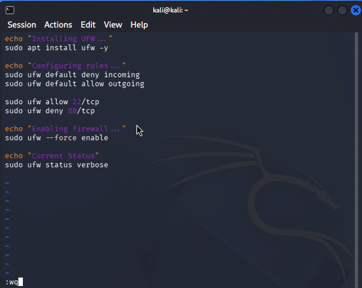
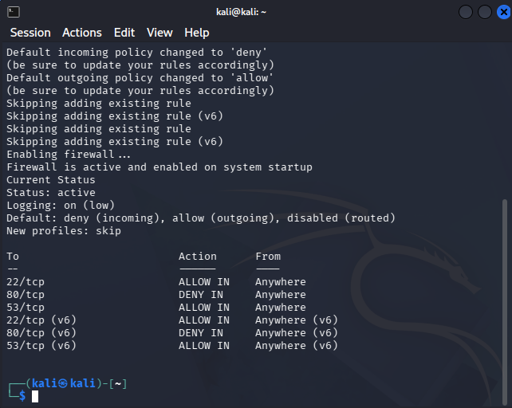

# UFW Firewall Configuration Report

## Objective

The objective of this task was to secure a Linux system using
**Uncomplicated Firewall (UFW)** by implementing firewall rules that
restrict unnecessary inbound connections while maintaining essential
administrative access.

## Configuration Details

The following configurations were applied:

-   **Default Incoming Policy:** Deny all incoming connections.
-   **Default Outgoing Policy:** Allow all outgoing connections.
-   **SSH (Port 22/tcp):** Allowed to ensure secure remote
    administration of the system.
-   **HTTP (Port 80/tcp):** Denied to prevent unwanted web traffic from
    reaching the host.
-   **DNS (Port 53/tcp):** Allowed to support domain name resolution
    services when required.

## Status Verification

The firewall status was verified using the following command:

``` bash
sudo ufw status verbose
```

The output confirms that UFW is active and enforcing the configured
rules:

  |To           | Action     |From|
  |-------------|---------   |------------|
  |22/tcp       | ALLOW IN   |Anywhere|
  |80/tcp       | DENY IN    |Anywhere|
  |53/tcp       | ALLOW IN   |Anywhere|
  |22/tcp (v6)  | ALLOW IN   |Anywhere (v6)|
  |80/tcp (v6)  | DENY IN    |Anywhere (v6)|
  |53/tcp (v6)  | ALLOW IN   |Anywhere (v6)|

Additionally, the screenshot indicates the following firewall settings:

-   Logging is enabled at the **low** level.
-   The firewall is **active and enabled on system startup**.
-   The default routed policy remains **disabled**.

## Significance

-   **Allowing SSH traffic** ensures that administrators can securely
    access and manage the system remotely.
-   **Blocking HTTP traffic** reduces the attack surface by preventing
    access to web services that are not required.
-   **Permitting DNS traffic** enables proper hostname resolution, which
    may be necessary for system updates and network-related operations.
-   **Enabling UFW at startup** guarantees that the firewall protections
    remain active after system reboots.

## Conclusion

The firewall configuration successfully achieved the intended security
objectives. The verification output confirms that only the necessary
services are permitted while unnecessary inbound access is restricted,
thereby improving the overall security posture of the Linux system.

## 3. Output

### ufw_configuration.sh



### Result


